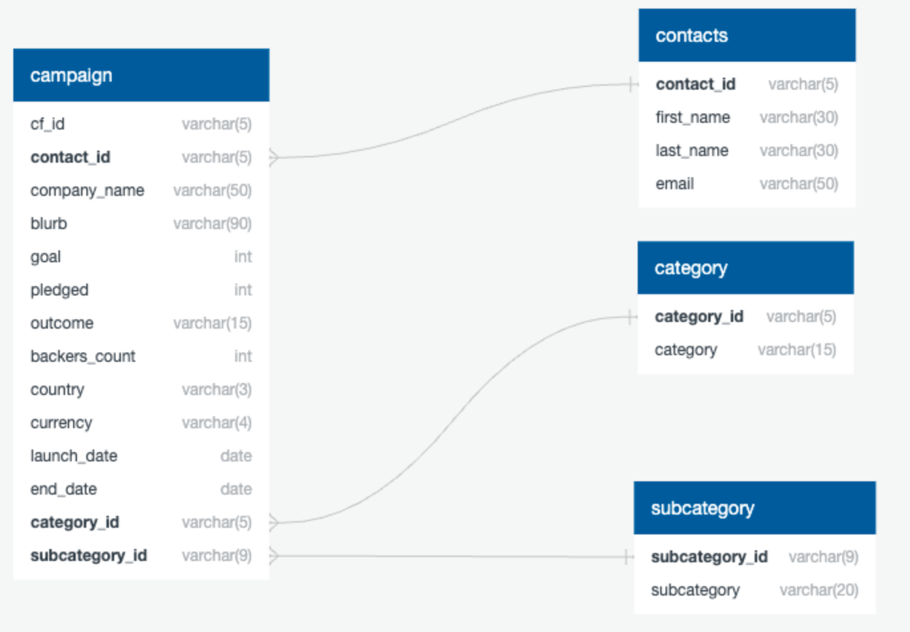
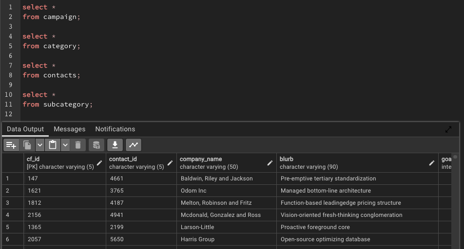
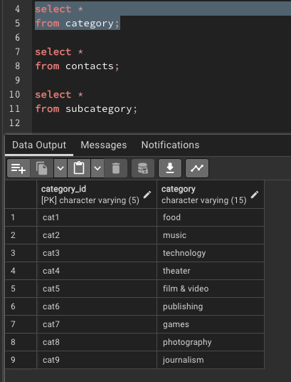
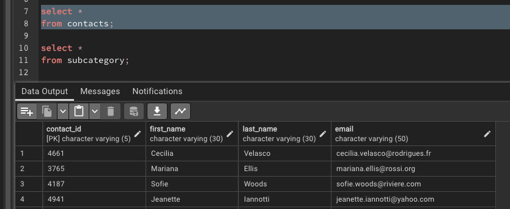
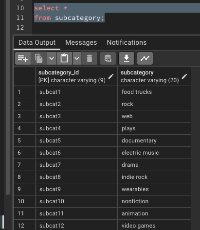

# Crowdfunding_ETL

## Description
Showcasing an ETL pipeline. 

## Table of Contents
- [Usage](#usage)

- [Installation_and_Setup](#installation-and-setup)

- [Table structure](#table-structure)

- [SQL Table Display](#sql-table-display)

- [License](#license)

- [Contact](#contact)

## Usage
Anyone who wants to use crowdfunding to support one of their projects. 

# Installation and Setup
Downloaded and used PostgreSQL 15

# Table structure

# SQL Table Display
Succesfully loaded campaign table. 

Successfully loaded category table. 

Successfully loaded contacts table. 

Successfully loaded subcategory table. 

## License
MIT

## Contact
If there are any questions of concerns, I can be reached at:
##### [github: velvetklr](https://github.com/velvetklr)
##### [email: velvetklr@gmail.com](mailto:velvetklr@gmail.com)
